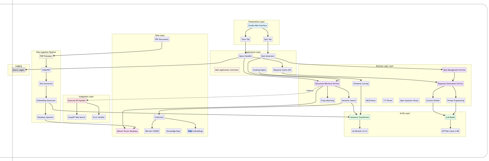

# 📘 **CS5342 — Network Security Project**
## **Round-2 Prototype Submission — README**
### **Local Network-Security Tutor & Quiz Agent (Privacy-Preserving)**

---

# 🔥 **1. Project Statement**

Network security courses include hundreds of pages of slides, textbook content, and quizzes. Manually searching these documents is time-consuming, and using online LLMs (ChatGPT, Gemini) violates **data privacy requirements** because documents cannot be uploaded to the cloud.

To solve this, we built a **local, privacy-preserving AI Tutor & Quiz Generator** that:

- Runs fully **offline**
- Processes **local network security documents only**
- Answers questions with **document-level citations**
- Generates **MCQs, True/False, and Open-ended quizzes**
- Provides **auto-grading & feedback**
- Protects student data using a **local vector database + local LLM**

This meets **all Round-2 CS5342 project requirements**.

---

# 🧠 **2. Project Description**

Our system has **two core agents**:

### **1️⃣ Q&A Tutor Agent**
- Takes any network-security question  
- Converts the question into embeddings  
- Retrieves relevant document chunks from Qdrant  
- Generates a response using GPT4All  
- Displays **citation (document + page number)**  
- Works 100% offline  

### **2️⃣ Quiz Agent**
- Generates **topic-specific quizzes**  
- Generates **random quizzes**  
- Supports:
  - MCQs  
  - True/False  
  - Open-ended questions  
- Grades user answers using similarity scoring (FuzzyWuzzy)  
- Provides feedback + correct answers + citations  

---

# 🖥️ **3. System Environment**

### **Operating Systems**
- macOS  
- Windows  
- Linux  

### **Python Version**
- Python **3.9 or above**

### **Hardware Requirements**
- 8GB RAM minimum  
- CPU-only supported (no GPU required)

---

# 📦 **4. Adopted Libraries**

| Library | Purpose |
|--------|---------|
| **sentence-transformers** | Creates embeddings for text |
| **qdrant-client** | Vector database connection |
| **gradio** | Web-based UI |
| **gpt4all** | Lightweight offline LLM |
| **pymupdf (fitz)** | Extract text from PDF documents |
| **fuzzywuzzy** | Similarity scoring for grading |
| **python-Levenshtein** | Enhances fuzzy matching speed |

Install all dependencies:

```
pip install fuzzywuzzy python-Levenshtein sentence-transformers qdrant-client gradio gpt4all pymupdf
```

---

# 🐳 **5. Qdrant Setup (Vector Database)**

Start Qdrant locally using Docker:

```
docker pull qdrant/qdrant
docker run -p 6333:6333 qdrant/qdrant
```

---

# 🔧 **6. Virtual Environment Setup**

### **macOS/Linux**
```
python3 -m venv venv
source venv/bin/activate
```

### **Windows**
```
python -m venv venv
venv\Scripts\activate
```

If PowerShell gives permission error:
```
Set-ExecutionPolicy RemoteSigned -Scope CurrentUser
```

---

# 📁 **7. Project Structure**

```
project/
│── Scripts/
│   ├── initialise_qdrant.py
│   ├── Data_insertion_qdrant.py
│   ├── chatbot_application.py
│── knowledge_base/
│   ├── (lecture slides, textbook pages, quizzes)
│── README.md
│── requirements.txt (optional)
│── venv/ (ignored)
```

---

# 📚 **8. Training Data & Data Format**

### **Knowledge Documents**
Stored in:

```
knowledge_base/
```

Includes:
- CS5342 lecture slides  
- Textbook pages  
- Quizzes  
- Any additional network-security PDFs  

### **Chunking Method**
- PDFs extracted using **PyMuPDF**  
- Each page converted to text  
- Text split into chunks of ~500–700 characters  

### **Embedding Model**
- `all-MiniLM-L12-v2`  
- Embedding vector size: **384**  
- Distance metric: **cosine similarity**

### **Qdrant Collection Structure**

Each entry contains:
- `text`  
- `document_name`  
- `page_number`  
- `embedding` vector  

---

# 🔄 **9. Execution Flow**

### **Step 1 — Initialize Database**
```
python Scripts/initialise_qdrant.py
```

### **Step 2 — Add PDFs**
Place all documents into:
```
knowledge_base/
```

### **Step 3 — Insert Data into Qdrant**
```
python Scripts/Data_insertion_qdrant.py
```

### **Step 4 — Launch the Tutor/Quiz Bot**
```
python Scripts/chatbot_application.py
```

### **Step 5 — Access Web UI**
Visit:
```
http://127.0.0.1:7860
```

---

# 🧱 **10. System Architecture Diagram**



---

# 🤖 **11. Core Features**

### ✔ Q&A Tutor Agent  
### ✔ Quiz Agent  
### ✔ Offline, Privacy-Preserving  
### ✔ Auto-Grading  
### ✔ Citations Included  

---

# 🐞 **12. Issues & Solutions**

### **Issue — Qdrant not running**
Fix: Restart Docker.

### **Issue — PyMuPDF error**
Fix:
```
pip install pymupdf
```

### **Issue — venv not activating**
Fix:
```
Set-ExecutionPolicy RemoteSigned -Scope CurrentUser
```

---

# 💡 **13. Suggestions & Feedback**

- Add Wireshark-based analysis for bonus  
- Improve user interface  
- Add dark mode  
- Add exportable reports  

---

# 🧾 **14. Commands Summary**

```
docker pull qdrant/qdrant
docker run -p 6333:6333 qdrant/qdrant

python -m venv venv
source venv/bin/activate
venv\Scripts\activate

pip install fuzzywuzzy python-Levenshtein sentence-transformers qdrant-client gradio gpt4all pymupdf

python Scripts/initialise_qdrant.py
python Scripts/Data_insertion_qdrant.py
python Scripts/chatbot_application.py
```

---

# 📚 **15. References**

1. TechTalks — Private ChatGPT  
2. CommandBar Blog — LangChain  
3. GPT4All Documentation  
4. Qdrant Documentation  
5. RAG & Agent-Based Tutorials  
